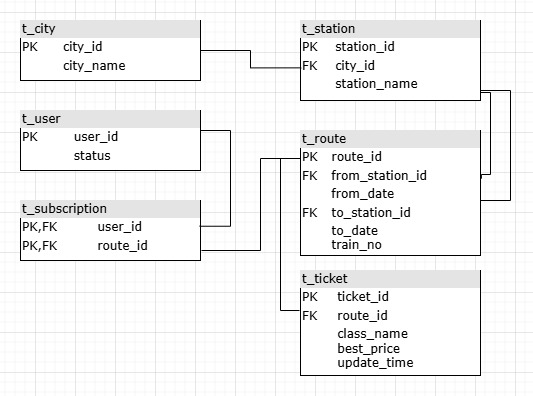

## **Что \- кратко:**  

Создание тг-бота для отслеживания цен на билеты на поезда с минимальными затратами. Основные функции:

* **Парсинг цен**: Сбор и анализ стоимости билетов из различных источников.  
* **Алерты об изменении цен**: Уведомления пользователям, когда цены опускаются ниже среднего или достигают заданного уровня.  
* **Основная задача**: Помощь пользователям в  нахождении лучших предложений без ручного поиска, отправка уведомлений о нужных предложениях, предоставление стоимостей билетов.

## **Что \- подробно (функционал):** 

**Сбор**

* **Парсинг цен на билеты, и др. информации по запросу**  
* **Источники** \- интеграция с базами данных о стоимости билетов на поезда.  
* **Частота обновления:** Обновляем историю стоимостей на подписанные билеты и алерты с определенной частотой (2 часа?)

**Обработка данных**

* **Различный анализ стоимостей билетов:** Вычисление средних цен, минимальных и максимальных значений за определенные периоды. (возможны еще всякие штуки)  
* **Поиск билетов:** Ввод начальной и конечной точек маршрута, даты поездки и других параметров

**Технические особенности**

* **База данных:**Организация эффективного хранения исторических цен, организация быстрого поиска данных при визуализации и анализе

## **UI:**  

* Пользовательский интерфейс реализован в виде тг-бота. В нем можно выбрать город отправления, город прибытия и дату путешествия. Можно одновременно отслеживать несколько билетов.

## **Структура проекта:** 

**Стек технологий:** Python, SQL, postgresql, psycopg, sqlalchemy, alembic, pandas, csv, matplotlib|seaborn, telebot, pytest, requests \+???

**Схема бд:**

****

## 

## **Роли \- задачи:**  

### **Распределение по ролям:**

1. **Парсер и сбор данных \-** Эдуард Багдасарян(@kgss50)  
2. **Проектирование базы данных и разработка запросов \-** Костромина Елизавета(@azzzile)  
3. **Разработка и развертывание Telegram-бота \-** Александр Болгов(@alxadrb) 

### **Подробное распределение задач (примерно):**

#### **0\. Общее глобальное: разобраться с API РЖД**

#### **1\. Парсер и сбор данных**

* Разработка парсера для сбора данных о ценах на билеты.  
* Интеграция с данными API РЖД.  
* Обеспечение регулярного обновления цен.

#### **2\. Проектирование базы данных и разработка запросов**

* Разработка схемы бд.  
* Оформление запросов.  
* Связка с Telegram-ботом.

#### **3\. Разработка и развертывание Telegram-бота**

* Разработка интерфейса и логики Telegram-бота.  
* Интеграция бота с backend API для получения и отправки данных.  
* Реализация функций поиска билетов и управления алертами.

## **Микропланчик:**

Дата КТ-1: 3 ноября 23:59:59   \< только репа плюс этот док

Дата КТ-2: 4 декабря 23:59:59  \< релиз

Дата защиты: 23 декабря ??:??